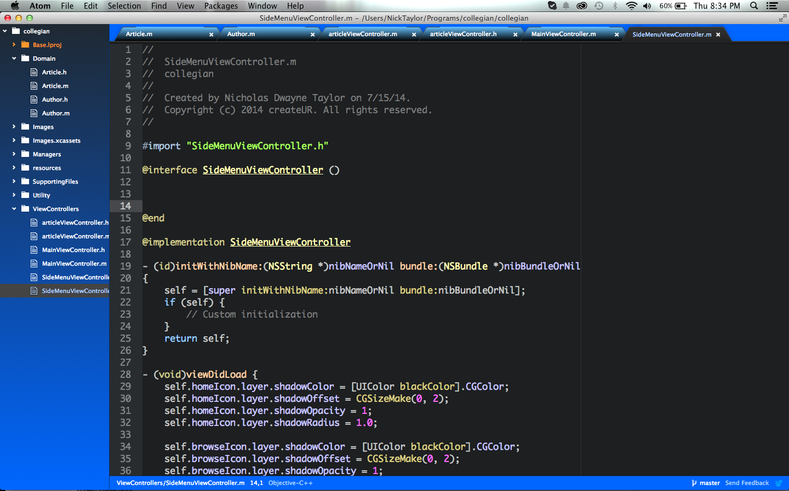

# Atom Blue Dream UI

Theme for those who like the color blue.

This theme is installed by default with Atom and can be activated by going to
the _Themes_ section in the Settings view (`cmd-,`) and selecting it from the
_UI Themes_ drop-down menu.

